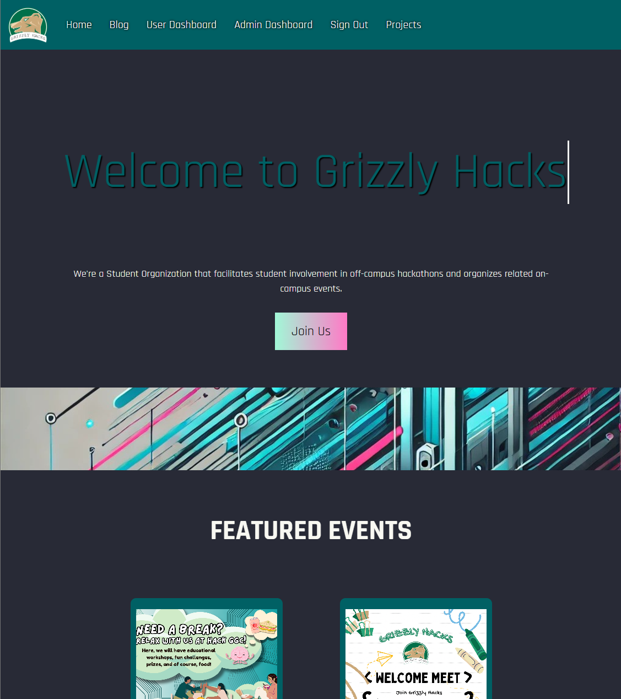
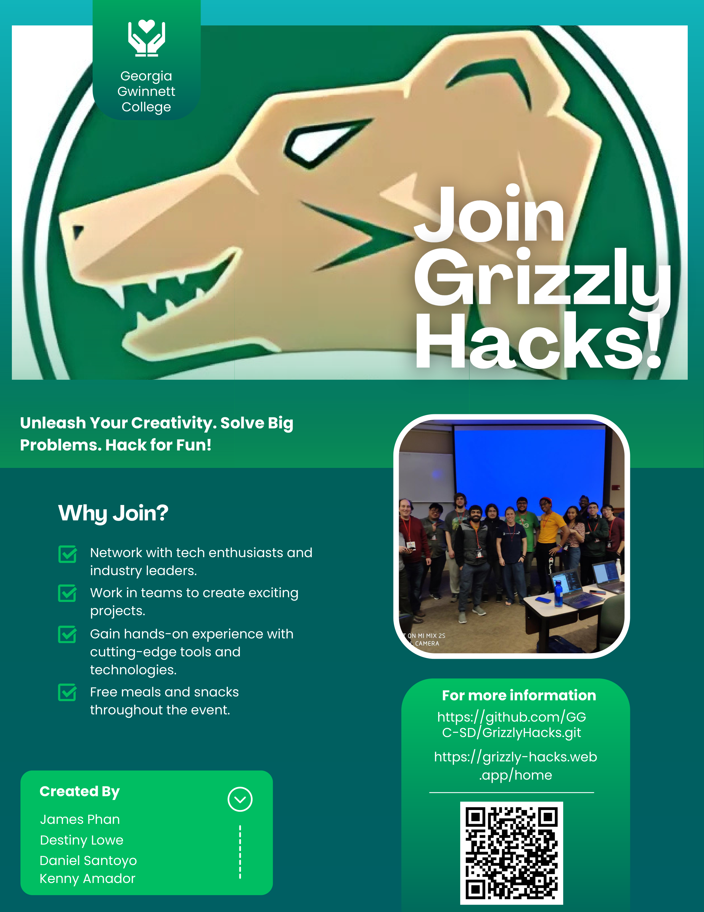

# Grizzly Hacks

<br></br>

## Description

The Grizzly Hacks client, which is a RSO of people who are interested in Hackathons, has tasked the team to work on their previous website, update it with modern features, and to add new components that will allow the clients and future users to access a website that will easily portray news, host events, and provide information about previous Hackathons. The website should have different authentication levels that allow admins to easily edit and add new information onto the website, while users to gain access to features so they can join feature Hackathons and post submissions for current events.

<br></br>

## Links

- [Deployed Project]
- [Project Documentation]

<br></br>

## Technologies

- Node.js
- Angular
- Bootstrap
- HTML/CSS
- Firebase
- TypeScript

<br></br>

## Working Features

- Real-time Application
- Social Media Links
- Registration System
- Event and Blog Post System
- Sponsors Section
- FAQs
- Mobile Device Friendly

<br></br>

## Installation Steps

Use the following commands to install Angular, creating a new project, and serving it. <br /><br />

1. clone the repo
   ```
   git clone https://github.com/GGC-SD/GrizzlyHacks
   ```
1. change directory
   ```
   cd GrizzlyHacks/WebPage/GGCHacks
   ```
1. install the repo with npm
   ```
   npm install
   ```
1. install the Angular command-line tool
   ```
   npm install -g @angular/cli
   ```
1. create file `environments/environment.ts` with the following content and replace the `...` section with the correct Firebase keys.

```
// This file can be replaced during build by using the `fileReplacements` array.
// `ng build --prod` replaces `environment.ts` with `environment.prod.ts`.
// The list of file replacements can be found in `angular.json`.

export const environment = {
  production: false,
  firebase : {
    ...
  }
};

/*
 * For easier debugging in development mode, you can import the following file
 * to ignore zone related error stack frames such as `zone.run`, `zoneDelegate.invokeTask`.
 *
 * This import should be commented out in production mode because it will have a negative impact
 * on performance if an error is thrown.
 */
// import 'zone.js/dist/zone-error';  // Included with Angular CLI.
```

1. serve the project

```
ng serve
```

1. After these steps, go to http://localhost:4200 in your browser.<br />Below is a screenshot of the home page of the website.Only the admins will be able to see the Admin Dashboard.<br /><br />

<br /><br />

<br></br>

## HoneyPot - Spring 2025 :paintbrush:

- **William Randazzo**

  - _UI/UX_
  - Client Liaison

- **Steven Lopez**
  - Code Architecture/Lead Programmer
  - Project Manager

- **Derron Pierre**
- _Data modeler_
- _Documentation Lead_

## Website Wizards - Fall 2024

- **Kenny Amador** :construction_worker:

  - Data modeler
  - Client Liaison

- **_Destiny Lowe_** :paintbrush:

  - _UI/UX Specialist_
  - _Documentation Lead_

- **Jimmy Phan** :computer:

  - _Lead Programmer/Code Architecture_
  - _Testing Lead_

- **Daniel Santoyo** :computer:
  - _Project Manager_
  - _Programmer/Code Architecture_

## Original Contributors

- **Josh Beers** :crown:
  - Lead Programmer
  - Project Manager
- **Danielle Battle** :art:
  - UX/UI
  - Document Lead
- **Anne Joseph** :bar_chart:
  - Data Modeler
  - Testing Lead

<br></br>

## Project Flyer and Video

**OUTDATED** All the features are demonstrated in this [video](https://www.youtube.com/watch?v=1dRrcsm5qKo).<br /><br />
**UPDATED Website Demo as of Nov 21/2024**
link to the [video](https://www.youtube.com/watch?v=DUOhE-9DSAE)



You can also view our website by clicking on this [link](https://grizzly-hacks.web.app).

<br></br>

## Repo Link

[Repo Link](https://github.com/GGC-SD/GrizzlyHacks)
